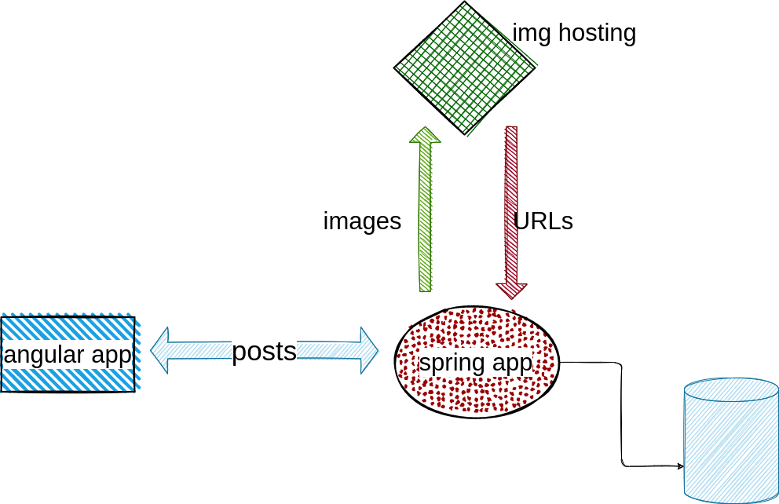
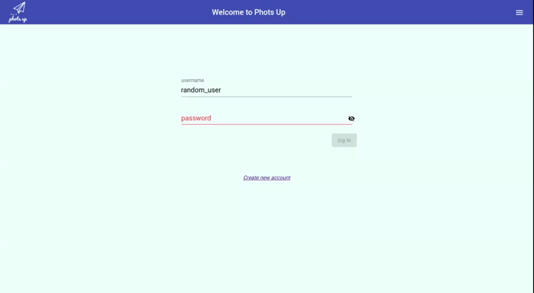
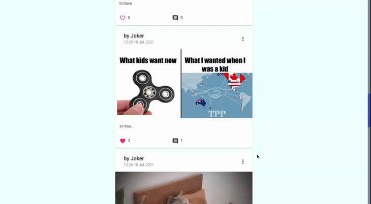

# Phot's up - spring boot webflux, data jpa, security, jwt, it uses angular as a client

## https://phots-up.herokuapp.com

### since those apps run on heroku free tier and heroku shuts down idle apps it can takes a while for requesting it the first time

## workflow

### authorization

### post publishing

### notifications through websocket

### some others

